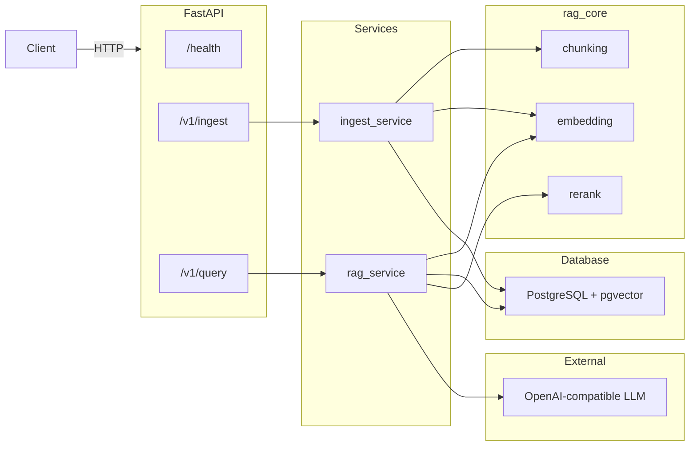

# RAGOps API

> Production-style Retrieval-Augmented Generation service built with FastAPI, PostgreSQL + pgvector, and sentence-transformers. Upgrades the [from-scratch RAG pipeline](https://github.com/Archit-Konde/RAG) to a containerised, testable API with CI regression gating.


---

## Architecture



**Layered design:** Routers → Services → DB / rag_core. No business logic in routers.

---

## Tech Stack

| Component | Technology |
|-----------|-----------|
| API | FastAPI with auto OpenAPI docs |
| Database | PostgreSQL 15 + pgvector (HNSW index) |
| Embeddings | sentence-transformers (all-MiniLM-L6-v2, 384-dim) |
| Reranker | cross-encoder (ms-marco-MiniLM-L-6-v2) |
| LLM | Raw HTTP to any OpenAI-compatible endpoint |
| Containerisation | Docker Compose (api + postgres) |
| CI | GitHub Actions — pytest + ruff on push |
| Config | pydantic-settings via `.env` |

---

## Quickstart

```bash
git clone https://github.com/Archit-Konde/RAGOps.git
cd RAGOps

# Configure environment
cp .env.example .env
# Edit .env — add your OPENAI_API_KEY

# Start services
make up

# Run database migration (auto-runs on first docker compose up)
make migrate

# Verify
curl http://localhost:8000/health
# → {"status": "ok", "version": "0.1.0"}
```

### Local development (without Docker)

```bash
python -m venv .venv
source .venv/bin/activate   # Windows: .venv\Scripts\activate
pip install -r requirements.txt

# Start PostgreSQL with pgvector separately, then:
uvicorn apps.api.app.main:app --reload --port 8000
```

---

## API Endpoints

| Method | Path | Description |
|--------|------|-------------|
| `GET` | `/health` | Liveness probe |
| `POST` | `/v1/ingest` | Upload a document (`.txt`, `.md`, `.pdf`) for chunking and embedding |
| `POST` | `/v1/query` | Ask a question — returns answer with source attribution |
| `GET` | `/docs` | Interactive OpenAPI documentation (Swagger UI) |
| `GET` | `/redoc` | ReDoc API documentation |

### Ingest a document

```bash
curl -F "file=@document.txt" http://localhost:8000/v1/ingest
```

```json
{
  "document_id": "a1b2c3d4-...",
  "num_chunks": 12,
  "status": "ingested"
}
```

### Query

```bash
curl -X POST http://localhost:8000/v1/query \
  -H "Content-Type: application/json" \
  -d '{"query": "What is HTTP?", "top_k": 5}'
```

```json
{
  "answer": "HTTP is an application-layer protocol... [Source 1]",
  "sources": [
    {"source_num": 1, "chunk_id": "...", "document_id": "...", "chunk_index": 0, "score": 0.95}
  ],
  "model": "gpt-4o-mini",
  "usage": {"prompt_tokens": 450, "completion_tokens": 120}
}
```

---

## Running Tests

```bash
# All tests
make test

# With coverage
pytest tests/ --cov=apps --cov=packages --cov-report=term-missing

# Fast tests only (skip embedding model download)
pytest tests/test_health.py tests/test_ingest.py -v
```

---

## Linting

```bash
make lint
# Runs: ruff check . && ruff format --check .
```

---

## Benchmarks

Run the benchmark script against an inline test corpus:

```bash
make benchmark
```

| Metric | Dense + Rerank |
|--------|---------------|
| Precision@5 | — |
| Recall@5 | — |
| MRR | — |

_(Run `make benchmark` to populate results.)_

---

## Project Structure

```
ragops-api/
├── apps/api/app/
│   ├── main.py              # FastAPI app factory + lifespan
│   ├── settings.py           # Pydantic BaseSettings
│   ├── deps.py               # Dependency injection
│   ├── routers/
│   │   ├── health.py         # GET /health
│   │   ├── ingest.py         # POST /v1/ingest
│   │   └── query.py          # POST /v1/query
│   ├── services/
│   │   ├── ingest_service.py # File → chunks → embeddings → DB
│   │   └── rag_service.py    # Query → retrieve → rerank → LLM
│   ├── db/
│   │   ├── models.py         # SQLAlchemy models (Document, Chunk)
│   │   ├── session.py        # Async engine + session management
│   │   └── migrations/
│   │       └── 001_init.sql  # Schema + pgvector HNSW index
│   └── observability/
│       └── metrics.py        # Structured logging
├── packages/rag_core/
│   ├── chunking.py           # Recursive text chunker
│   ├── embedding.py          # SentenceTransformer wrapper
│   ├── retrieval.py          # pgvector search + RRF fusion
│   └── rerank.py             # Cross-encoder reranker
├── tests/
│   ├── test_health.py
│   ├── test_ingest.py
│   └── test_retrieval.py
├── scripts/
│   └── run_benchmark.py      # Precision@k, Recall@k, MRR
├── docker-compose.yml
├── Dockerfile
├── Makefile
├── requirements.txt
└── .github/workflows/ci.yml
```

---

## License

[MIT](LICENSE)
